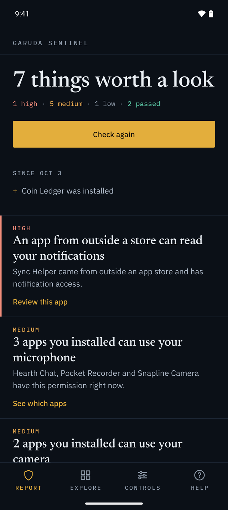
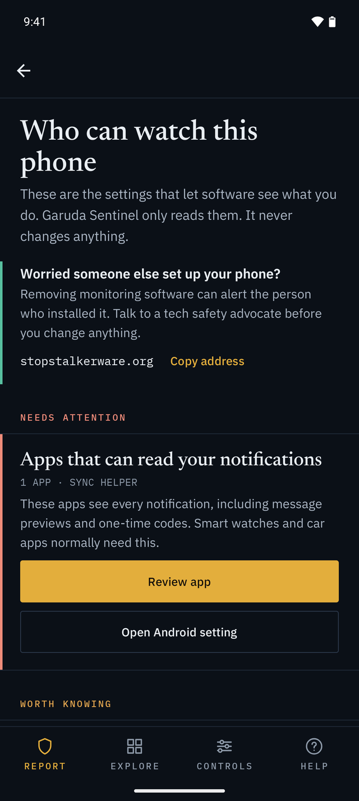
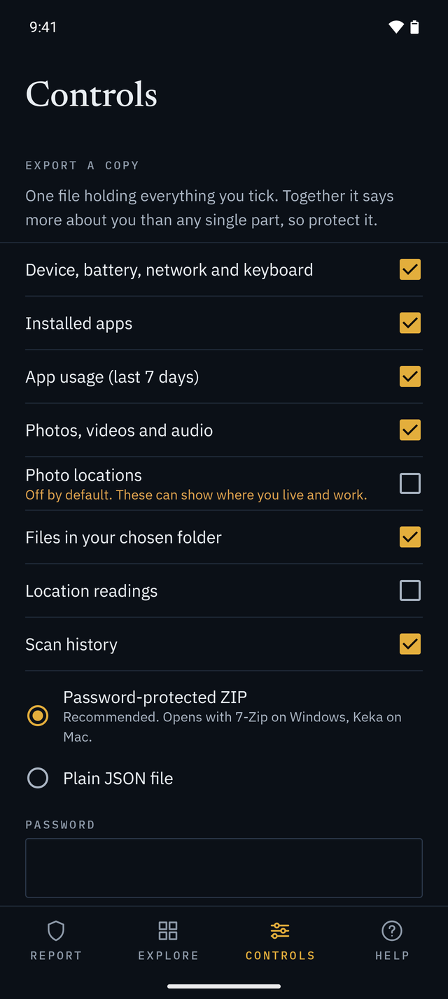
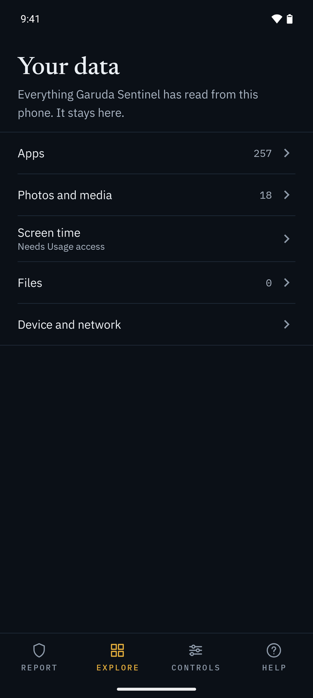

# Garuda Sentinel

A personal Android privacy tool by Corbray Technologies. It shows you the metadata your own phone holds (apps and their permissions, photo EXIF including GPS, app usage, device and network facts) and explains what it could reveal.

The app opens on a Report: a ranked list of what is worth a look, each with a plain sentence and one action that opens the right Android settings screen. The raw data sits under Explore, export and deletion under Controls, and permissions, FAQ and About under Help. The app only reads; it never changes another app or a setting.

<p align="center">
  
  
  
  
</p>

<p align="center"><sub>Report, Who can watch, Controls and Explore. Sample data on an emulator; the apps shown are made up.</sub></p>

**Nothing leaves the phone.** The app does not request the `INTERNET` permission, so Android blocks every network connection. Results live in private app storage, are excluded from backup and device transfer, and can be exported only to a file the user picks. Distribution is by sideloaded APK only.

## Build

Requirements: Android Studio (its bundled JDK 21 works), Android SDK platform 36.

```
./gradlew assembleDebug          # app/build/outputs/apk/debug/app-debug.apk
./gradlew testDebugUnitTest      # JVM unit tests
./gradlew lint                   # should report 0 errors
./gradlew assembleRelease        # minified; unsigned unless keystore.properties exists
```

Toolchain: Gradle 9.7.1, AGP 9.4.1 (built-in Kotlin), Kotlin 2.4.20, KSP 2.3.7, Room 2.8.5, Compose BOM 2026.04.01. compileSdk and targetSdk 36, minSdk 29 (Android 10).

## Release signing

The 2025 keystore's password was lost, so it cannot be used (a copy is archived outside the repo). To sign releases, create a new key once and keep it and its passwords somewhere safe (a password manager); losing it again means users cannot upgrade.

```
keytool -genkeypair -v -keystore garuda-release.jks -alias garuda -keyalg RSA -keysize 4096 -validity 10000
```

Then create `keystore.properties` in the project root (git-ignored, as are `*.jks` files):

```
storeFile=garuda-release.jks
storePassword=...
keyAlias=garuda
keyPassword=...
```

Before distributing, publish the APK's SHA-256 (`certutil -hashfile app-release.apk SHA256` on Windows) next to the download, and register the package name `com.corbraytechnologies.garudasentinel` for Android developer verification.

## Code map

```
app/src/main/java/com/corbraytechnologies/garudasentinel/
  GarudaApp.kt          Application + AppContainer (manual dependency wiring, app-context only)
  MainActivity.kt       Edge-to-edge host for Compose
  collect/              One collector per data source; reads the OS, never guesses
  data/                 Room entities, DAOs, database (schema exported to app/schemas), DataStore settings
  scan/ScanCoordinator  Runs a scan on the app scope with per-step status; writes Room
  export/               Export schema (v2), pure ExportBuilder, ExportDefaults, ExportService (Save dialog), DataWiper
  findings/             Pure rules that rank what the Report shows, plus its wording
  permissions/          Permission checks and settings intents; nothing is gated
  ui/                   Bottom bar navigation (Report, Explore, Controls, Help), view models, screens,
                        shared components, theme
  utils/                App and media categorizer, sensitive-permission labels, formatters
```

## Docs

- `docs/ARCHITECTURE.md`: how the app is built and how each privacy promise is enforced in code.
- `SECURITY.md`: what the app accesses, how to verify a release, and how to report a vulnerability.

## License

Copyright (C) 2025-2026 Karl Corbray

Garuda Sentinel is free software, licensed under the GNU General Public License v3.0. See `LICENSE` for the full text.

Published by Corbray Technologies.

The name Garuda Sentinel and the Garuda logo are trademarks of Corbray Technologies and are not licensed under the GPL. Modified versions must use a different name and logo, and must not imply they come from Corbray Technologies.

The bundled fonts (IBM Plex Sans, IBM Plex Mono and Newsreader) are licensed under the SIL Open Font License 1.1. Their license texts are in `app/src/main/assets/licenses/`.
